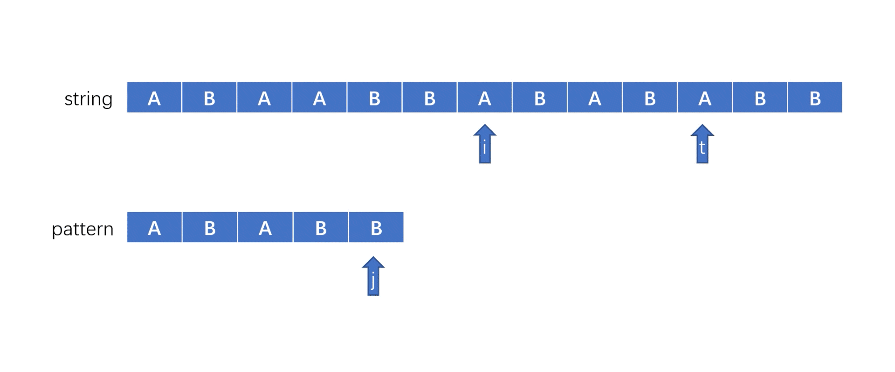

## 1.算法简介
<font size=3>
KMP算法的名字是由创造出该算法的三位工程师的名字首字母组成的，该算法是为了解决在字符串中匹配某个字串的问题。

在我们的生活中经常会遇到在字符串中匹配某个字串的情况，例如我们常在某个文本中查找某个部分，这时候就需要用到字符串匹配字串来帮助我们快速找到这个字串。
</font>

---
## 2.暴力和KMP的思路
<font size=3>

**我这里把被匹配的字符串称为string，需要查找的字串称为pattern。**

**以下动画只是展示逻辑顺序，一定要自己一步步画一下。**

- 暴力思路

对于这个问题有一个非常容易想到的思路，就是在string中遍历所有的字串，然后对所有的字串再一个个字符去匹配pattern，显然这样的时间复杂的就是n*m的。（其中n和m分别为string和pattern的长度。）


从中我们可以观察到有重复的匹配，例如

当t走到最后一个字符发现不匹配时i只向前移动了一个字符，而这个新的i指向的B是我们之前已经判断过的，这就出现了重复的判断。

- 补充知识点，前后缀（已经了解可以跳过）

前缀: 包含首字符且不包含尾字符的子串

后缀: 不包含首字符且包含尾字符的子串

(**注意后缀只是起点会变，而字串的顺序不会改变**)

例如: abcde

前缀：a, ab, abc, abcd

后缀：e, de, cde, bcde

- KMP

KMP算法就是在这个避免掉重复的思路下产生的，我们想让每次发现不匹配需要找到下一个新的子串起点i的时候，可以尽可能的避免掉之前已经判断过的字符。就拿上面这个重复判断的情况举例。

当t移动到最后一个发现不匹配的时候，我们想让i跳过一些已经判断过的字符，也就是从下标为6，7，8，9分别是ABAB的字符中挑选出我们新的i作为新的起点，而我们观察到，其中存在前缀AB(下标为6,7)和后缀AB(下标为8,9)是相等的，所以我们可以直接把后缀AB作为我们新字串已经判断过的部分，此时的i其实等同于原来的t，真正的i是位于下标为8的A处。

这样一来我们就可以直接省略掉t这个变量，直接把i当成我们的t，用来表示在string的某个子串中当前判断到第i个字符，至于到底是哪个字符为当前字串的起点(也就是真正的i)，我们就不用去表示了。

最后合并成一步就得到了以下步骤。



- next数组

最简单的方法就是暴力一个个去遍历所有的前后缀然后求出长度，这里就不展开了。

求解next数组的过程其实是动态规划的思维。

next数组就是将每个pattern[0]到pattern[i]子串的最长相等前后缀的长度-1给存了起来，方便每次我们遇到不匹配的字符时可以从next直接找到j应该回退的位置，也就是next[j - 1]。

先看一下求next数组的动画吧。


i: 表示的是后缀的末尾，所以i其实就标志着当前所求字串的最后一位

j: 表示的是前缀的末尾，j同时也是当前已经匹配过相等前后缀的长度-1

每当i后移一位，pattern[j]和pattern[i]是否相等就分成两种情况。

### 1.相等
相等的情况非常容易想到，只需要在前一个最长相等的前后缀的基础上+1就可以了。也就是next[i] = next[i - 1] + 1，然后将已经匹配上的前后缀后移即j+1，也就是相等前后缀的长度+1。

### 2.不相等
当pattern[i]!=pattern[j]的时候，我们需要把j回退，j = next[j - 1]。

这里为什么不是j = next[j]呢，因为j-1位置上的是已经匹配过的相等的前后缀，而当前的j位置是不匹配的。还有一个小细节，next[j]中存的是pattern[0]到pattern[j]子串的最长相等前后缀的长度，所以应该是j = next[j - 1] - 1(因为j是下标需要-1)，又因为回退完以后，j是在已经匹配过的相等的后缀末尾上(也就是新的子串的已经匹配上的前缀的末尾上)，所以我们还要j += 1后移一位来匹配当前的pattern[j]和pattern[i]是否匹配，最终就直接变成j = next[j - 1]。

当j一直回退到第一个字符串还不相等的时候，意味着没有已经匹配上的前缀，且第一个字符也不相等。
</font>

---
## 3.代码实现
```python
def getNext(pattern: str) -> list:
    next_ = [0] * len(pattern)   # 初始化
    j =  0   # 前缀的末尾
    i = 1   # 第一个字符没有相同前后缀，直接跳过
    # while i < len(pattern):
    #     if pattern[j] == pattern[i]:
    #         next[i] = next[i - 1] + 1
    #         j += 1      # 相等前后缀长度+1
    #         i += 1      # 判断下一个字符
    #     else:
    #         if j == 0:    # 没有已经匹配上的前缀，也就是已经匹配上的相等前后缀长度为0且当前字符不相等
    #             next[i] = 0   # 相等前后缀长度为0
    #             i += 1    # 判断下一个字符
    #         else:
    #             j = next[j - 1] - 1  # j回退到前一个最长相等前后缀的长度-1
    #             j += 1    # 现在的j是相等的前后缀位置，所以要后移一位然后再判断是否和pattern[i]相等
    #     以上代码可化简为
    while i < len(pattern):
        if pattern[j] == pattern[i]:
            next_[i] = next_[i - 1] + 1
            j += 1
            i += 1
        elif j == 0:
            next_[i] = 0
            i += 1
        else:
            j = next_[j - 1]
    return next_


if __name__ == '__main__':
    string = 'ABAABBABABABBABABB'
    pattern = 'ABABB'
    next_ = getNext(pattern)  # 创建next_数组
    i = 0   # 此时的i是string的某个子串中的第t位，真正的起点i在哪里不重要
    # 其实i-j就是起点，当前匹配的字符下标减去已经匹配上的前缀长度就是起点的下标
    j = 0   # pattern中已经匹配上的前缀长度
    while i < len(string):
        if string[i] == pattern[j]:     # 字符匹配成功
            j += 1  # 已经匹配上前缀长度+1
            i += 1
        elif j == 0:    # 第一个字符不相等且没有已经匹配上的前缀
            i += 1  # 说明当前的i为string的起点，且和pattern第一位不相等，直接跳过这个i
        else:   # 当前字符不相等且j不是第一位
                # j回退，并重新判断当前字符
            j = next_[j - 1]
        
        if j == len(pattern):
            print(i - j)
            j = 0
            # 这里不需要把i+=1因为上次匹配完pattern的时候已经i+=1
            # 只找首次出现就直接break
```