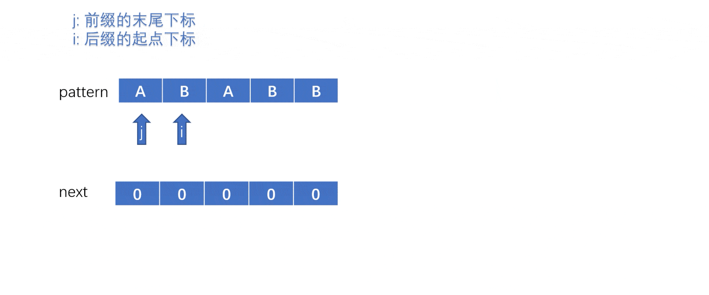

## 1.算法简介
<font size=3>
KMP算法的名字是由创造出该算法的三位工程师的名字组成的，该算法是为了解决在字符串中匹配某个字串的问题。

在我们的生活中经常会遇到在字符串中匹配某个字串的情况，例如我们常在某个文本中查找某个部分，这时候就需要用到字符串匹配字串来帮助我们快速找到这个字串。
</font>

---
## 2.暴力和KMP的思路
<font size=3>

**我这里把被匹配的字符串称为string，需要查找的字串称为pattern。**

**以下动画只是展示逻辑顺序，一定要自己一步步画一下。**

- 暴力思路

对于这个问题有一个非常容易想到的思路，就是在string中遍历所有的字串，然后对所有的字串再一个个字符去匹配pattern，显然这样的时间复杂的就是n*m的，而KMP算法直接把复杂度减到了n+m，下面我们看一下暴力的动画。（其中n和m分别为string和pattern的长度。）


暴力的代码会有大量的重复的匹配，例如

当t走到最后一个字符发现不匹配时i只向前移动了一个字符，而这个新的i指向的B是我们之前j和t已经判断过的，这就出现了重复的判断。

- 补充知识点，前后缀（已经了解可以跳过）

前缀: 包含首字符且不包含尾字符的子串

后缀: 不包含首字符且包含尾字符的子串

(**注意后缀只是起点会变，而字串的顺序不会改变**)

例如: abcde

前缀：a, ab, abc, abcd

后缀：e, de, cde, bcde

- KMP

KMP算法就是在这个避免掉重复的思路下产生的，我们想让每次发现不匹配需要找到下一个新的子串起点i的时候，可以尽可能的避免掉之前已经判断过的字符。就拿上面这个重复判断的情况举例。

当t移动到最后一个发现不匹配的时候，我们想让i跳过一些已经判断过的字符，也就是从下标为6，7，8，9分别是ABAB的字符中挑选出我们新的i作为新的起点，那我们就想利用已经判断过匹配的这个性质，如果已经判断过匹配的子串中其中存在某个前缀和后缀相等，那我们就可以把这个后缀直接当成我们新的子串的前缀，因为已经判断过匹配了嘛，等于就是把已经判断匹配的子串前面一部分丢掉一些，那我们观察到例子中有前缀AB(下标为6,7)和后缀AB(下标为8,9)是相等的，所以我们直接把后缀AB作为我们新子串中已经判断过的部分，此时的i其实等同于原来的t，真正的i是位于下标为8的A处。

这样一来我们就可以直接省略掉t这个变量，直接把i当成我们的t，用来表示在string的某个子串中当前判断到第i个字符，至于到底是哪个字符为当前子串的起点(也就是真正的i)，我们就不用去表示了。

- next数组

next数组就是将pattern的每个子串的最长相等前后缀的长度给存了起来，方便每次我们遇到不匹配的字符时可以从next直接找到j应该回退的下标。其想法就是每当遇到字符不匹配的时候，可以直接在之前判断过的子串中找到某个后缀等于前缀，这样就可以直接把后缀当新子串的已经匹配过的前缀跳过去了。

那怎么求这个前缀表next呢，最简单的方法就是遍历pattern所有的子串的当相等的时候就是前一个子串的最长相等前后缀的长度+1，也就是next[j - 1] + 1，不相等的时候再减少一个字符再判断一次。这样其实就比较慢了，还记得next数组中存的是啥吗，我们来看看KMP中求解next数组的过程。

i 表示的是后缀的最右侧，所以 i 同时也是当前所求子串的最后一位字符的下标。

j 表示的是前缀的最右侧，所以 j 同时也是当前已经匹配过相等前后缀的长度-1（j是下标），因为 j 和 i 所指的字符不相等的时候我们是要回退 j 的。

每当 i 后移一位，也就是子串新增一个字符的时候，j 和 i 所指的字符是否相等。
### 1.相等
相等的情况非常容易想到，只需要在当前已经匹配上的最长相等前后缀长度的基础上+1就可以了，即next[i] = j + 1。
### 2.不相等
当 pattern[i] != pattern[j] 的时候，我们需要把j回退，j = next[j - 1]。

还记得next数组里存的是什么吗，我们定义的就是 next[j] 放的是 pattern[0] 到 pattern[j] 这个子串的最长相等前后缀的长度，所以我们可以通过 next[j-1] 直接定位到新的 j 的位置。为什么呢，next[j-1] 中存放的是前一个子串中后缀和前缀相等的长度，也就是和之前一样直接把后缀当我们新的子串的已经匹配过的前缀，然后因为我们存的是长度也就是下标+1，所以直接 j = next[j - 1]就可以了，省略了再后移 j 到新字符的过程。再重新判断一次 j 和 i 所指的字符是否相等就可以了。

当j一直回退到第一个字符串还不相等，意味着没有已经前一个子串，且第一个字符也不相等。那我们就直接跳过这个 i ，找下一个起点。（这个时候 i 就是新子串的真正的起点，之前都只是等同于 t ，因为还有前缀嘛，这里是没有前缀了）

最后我们完整的看一下KMP算法的动画感受一下。


</font>

---
## 3.代码实现
```python
def getNext(pattern: str) -> list:
    next_ = [0] * len(pattern)   # 初始化
    j =  0   # 前缀末尾
    i = 1   # 后缀末尾，且单个字符没有前后缀，直接跳过
    # while i < len(pattern):
    #     if pattern[j] == pattern[i]:
    #         next[i] = j + 1
    #         j += 1      # 当前相等前后缀长度+1
    #         i += 1      # 判断下一个字符
    #     else:
    #         if j == 0:    # 已经没有前一个子串了，也就是当前 i 指代就是新子串的起点并且 j 和 i 所指字符还不相等
    #             next[i] = 0   # 相等前后缀长度为0
    #             i += 1    # 判断下一个字符
    #         else:
    #             j = next[j - 1] -	1   # j回退到前一个最长相等前后缀的长度-1（也就是下标）
    #             j += 1    # 现在的j是新子串的前缀末尾位置，所以要后移一位然后再判断当前的字符是否和pattern[i]相等
    #     以上代码可化简为
    while i < len(pattern):
        if pattern[j] == pattern[i]:
            j += 1
            next_[i] = j
            i += 1
        elif j == 0:
            i += 1
        else:
            j = next_[j - 1]
    return next_


if __name__ == '__main__':
    string = 'ABAABBABABABBABABB'
    pattern = 'ABABB'
    next_ = getNext(pattern) 	 # 创建next_数组
    i = 0  	 # 此时的i是string的某个子串中的第t位，真正的起点i在哪里不重要
    # 其实i-j就是起点，当前匹配的字符下标减去已经匹配上的前缀长度就是起点的下标
    j = 0  	 # pattern中已经匹配上的前缀长度
    while i < len(string):
        if string[i] == pattern[j]:     # 字符匹配成功
            j += 1  	# 把已经匹配上的前缀长度+1
            i += 1
        elif j == 0:	# 已经没有匹配上的前缀了，也就是当前 i 指代就是新子串的起点并且 j 和 i 所指字符还不相等
            i += 1  # 直接跳过这个i
        else:   # 当前字符不相等且j不是第一位
                # j回退，并重新判断当前字符和求next数组那里同理
            j = next_[j - 1]
        
        if j == len(pattern):	# 这个判断要写在最下面，因为是在本轮判断完新字符后，判断是否已经找到成功匹配的模式串
            print(i - j)
            j = 0
            # 这里不需要把 i+=1 因为上次匹配完在字符匹配成功的时候已经 i+=1 后移一位了
            # 只找首次出现就直接break
```

---
## 4.总结
<font size=3>
最后我想说，KMP是一个非常经典的算法，学会他的过程可能很艰难，需要花可能几天的时间，但坚持多想想，总会拿下他的。当想到卡壳的时候，就休息休息，可能你回过头了一下子就相通了。最后真正领悟到他的巧妙的时候，会感到天空的晴朗与辽阔！！！
</font>
